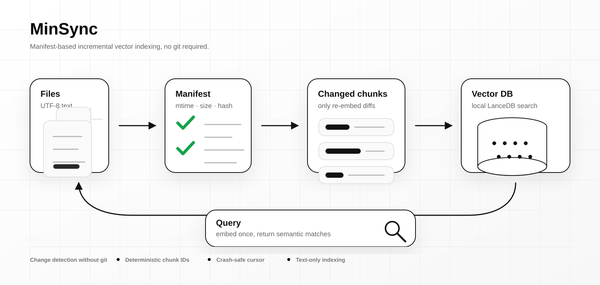

# MinSync

[English](README.md) | [한국어](README.ko.md)



MinSync is a manifest-based incremental vector database indexing CLI for text files. It does not need git: it tracks `mtime`, file size, and SHA-256 content hashes in `.minsync/`, re-embeds only changed chunks, sweeps stale chunks, and keeps a local LanceDB index ready for semantic search.

## Why MinSync

- **Git-free change detection**: works in any directory, including generated workspaces and agent sandboxes.
- **Incremental embeddings**: unchanged text is not chunked or embedded again.
- **Crash-safe state**: cursor updates happen only after processing completes.
- **Deterministic chunk IDs**: IDs derive from source, path, schema, content hash, and duplicate index.
- **Rust native**: a single CLI with chonkie-core chunking built in.
- **Text-only by design**: PDF, DOCX, XLSX, images, and other binary formats are treated as empty because MinSync does no extraction. Add them to `.minsyncignore`.

## Contents

- [Install](#install)
- [Usage](#usage)
- [How it works](#how-it-works)
- [Chunkers](#chunkers)
- [Vector store](#vector-store)
- [Embedding network reliability](#embedding-network-reliability)
- [Local embeddings with Hugging Face TEI](#local-embeddings-no-openai--hugging-face-tei)
- [.minsyncignore](#minsyncignore)
- [Development](#development)

## Install

Recommended install path:

```bash
curl -fsSL https://raw.githubusercontent.com/NomaDamas/MinSync/main/scripts/install.sh | sh
```

The installer asks whether to star the repository with `gh repo star NomaDamas/MinSync`. If `gh` is unavailable or not authenticated, it continues without failing.

Direct Cargo install:

```bash
cargo install minsync
```

From source:

```bash
git clone https://github.com/NomaDamas/MinSync.git
cd MinSync
cargo build --release
```

For OpenAI embeddings:

```bash
export OPENAI_API_KEY="sk-..."
```

For local embeddings, use the TEI setup below.

## Quick Start

```bash
minsync init                          # initialize .minsync/
minsync sync                          # index changed files incrementally
minsync sync --full                   # rebuild from scratch
minsync query "search text" --mode vector --k 5
minsync query "exact terms" --mode bm25 --k 5
minsync query "search text" --mode hybrid --k 5
minsync watch                         # initial sync, then re-index on file changes
minsync watch --watch-on-sync-error   # stay alive and retry after initial sync errors
minsync status                        # sync state
minsync check                         # health check
minsync verify --fix                  # consistency check + repair
```

Select the BM25 tokenizer preset during initialization:

```bash
minsync init --language ko
```

Supported values are `simple`, `ko`, `ja`, `zh`, `ar`, and `multilingual`.
Korean uses Kiwi through the `kiwi-rs` Rust binding, Japanese uses an embedded
Lindera dictionary, Chinese uses `jieba-rs`, and Arabic uses an in-process light
stemmer based on Discrawl PR #180.
Changing `[lexical].language` triggers a full rebuild on the next sync.

`minsync watch` performs an initial sync before waiting for filesystem events.
By default, an initial embedding or vector-store error stops the command,
matching `minsync sync` fail-fast behavior. Use
`--watch-on-sync-error` to keep the watcher alive and retry on later file
events; failures remain visible in the log and the cursor advances only after
a later sync succeeds.

Sync output reports file-level changes separately from chunk-level storage
effects: `files added/modified/deleted` describes source files, while
`chunks inserted/reused/removed` describes content-addressed index rows.
JSON sync output also reports `files_checked`, `elapsed_seconds`,
`freshness_check_only`, and `query_ready`. An unchanged incremental sync
rehashes the workspace to preserve content-hash correctness, then returns
without reading, chunking, embedding, writing, flushing, or rebuilding index
rows; its elapsed time therefore measures freshness-check cost. Changed and
full syncs include indexing and LanceDB maintenance in their elapsed time.
For a local, credential-free comparison, run `cargo run --quiet -- sync
--format json` twice, edit one tracked text file and run it again, then run
`cargo run --quiet -- sync --full --format json`. Query process startup is
outside this sync measurement.

Run the checked-in credential-free scale benchmark with:

```bash
cargo test --test issue_41_benchmark -- --nocapture
```

It generates the same local corpus at 1x, 2x, 4x, and 8x, reports full,
unchanged, and changed-file sync milliseconds, and reports p50/p95 for BM25,
vector, and hybrid retrieval. The benchmark intentionally uses the in-memory
store, so its query timings measure retrieval scaling separately from LanceDB
index maintenance; the LanceDB ANN/FTS threshold and unindexed-delta behavior
are covered by the live index tests. Timing values are observations, not a
machine-specific latency SLO.

Korean tokenization requires the official Kiwi native library and base model.
Set `KIWI_LIBRARY_PATH` to `libkiwi` and `KIWI_MODEL_PATH` to the extracted
`models/cong/base` directory. MinSync pins the unreleased ABI fix from
`JAICHANGPARK/kiwi-rs` until a corrected crates.io release is available.
On macOS/Linux, `bash scripts/install-kiwi.sh` downloads the matching official
assets and prints the required environment variables.
On Windows, run `powershell -ExecutionPolicy Bypass -File
scripts/install-kiwi.ps1` and set the printed paths in the environment.
The Windows CI uses the official Kiwi 0.22.2 assets until the remaining
`kiwi_config_t` ABI differences in the Rust binding are resolved upstream.

## How It Works

MinSync scans your directory, compares each text file to the manifest, chunks changed content once, and stores the same stable chunk IDs for vector and BM25 retrieval in LanceDB. Stale rows are removed by mark-and-sweep. Vector mode embeds the query, BM25 mode uses LanceDB full-text search without an embedding request, and hybrid mode combines both rankings with deterministic reciprocal rank fusion (RRF, `k=60`).

The selected analyzer converts documents and queries into the shared
`lexical_text` column before LanceDB BM25 indexing.

State lives in `.minsync/`:

| File | Purpose |
|---|---|
| `config.toml` | collection, chunker, embedder, vector store, normalization |
| `manifest.json` | last known file metadata and content hashes |
| `cursor.json` | last completed processing point |
| `txn.json` | in-progress transaction marker |
| `lock` | process lock |

Delete `.minsync/` to start fresh.

## Chunkers

| id | Strategy | Boundary stability under edits |
|---|---|---|
| `recursive` (default) | paragraph to sentence to line splits merged to a size budget | an edit near the top of a file can shift downstream boundaries |
| `chonkie` | delimiter/size-based chonkie-core chunking | same drift caveat as `recursive` |
| `cdc` | content-defined chunking with FastCDC-style rolling hash | small edits usually affect only nearby chunks |

Select at init time:

```bash
minsync init --chunker cdc
```

Or edit `.minsync/config.toml`:

```toml
[chunker]
id = "cdc"
```

Switching the chunker changes the chunk schema, so run `minsync sync --full` afterwards.

## Vector Store

MinSync stores vectors in embedded LanceDB by default:

```toml
[vectorstore]
id = "lancedb"

[vectorstore.options]
dimension = 1536
index_build_threshold = 256
index_optimize_delta_threshold = 10000
```

Set `dimension` to match your embedder:

| Embedder | Dimension |
|---|---:|
| `openai:text-embedding-3-small` | 1536 |
| `tei:intfloat/multilingual-e5-small` | 384 |
| `tei:BAAI/bge-m3` | 1024 |

MinSync builds an IVF-HNSW-SQ ANN index after `index_build_threshold` rows and incrementally optimizes unindexed deltas after `index_optimize_delta_threshold` rows. These thresholds are tuning knobs, not capacity limits.

Agents adding another vector store should implement the `VectorStore` trait and wire the new id through `create_vectorstore`. See `docs/EXTENDING.md` and `skills/minsync/SKILL.md` for the agent-facing extension checklist.

## Embedding Reliability

Embedding requests use per-request timeouts and retry transient failures: network errors, timeouts, HTTP 429, and HTTP 5xx. Permanent failures such as invalid auth, malformed responses, or validation errors fail immediately. A failed sync never advances the cursor or manifest, so the next `minsync sync` resumes safely.

```toml
[embedder]
max_retries = 3
timeout_seconds = 60
max_concurrent = 1
```

`base_url` also works for OpenAI-compatible gateways.

## Local Embeddings with TEI

Install and launch Hugging Face Text Embeddings Inference:

```bash
brew install text-embeddings-inference
text-embeddings-router --model-id intfloat/multilingual-e5-small --port 8080 --dtype float32
curl http://localhost:8080/health
```

Configure MinSync:

```bash
minsync init --embedder tei:intfloat/multilingual-e5-small
```

Then set the LanceDB dimension and TEI prefixes:

```toml
[embedder]
id = "tei:intfloat/multilingual-e5-small"
base_url = "http://localhost:8080"
query_prefix = "query: "
passage_prefix = "passage: "

[vectorstore.options]
dimension = 384
```

Run:

```bash
minsync sync --full
minsync query "검색어" --k 5
```

## Ignoring Files

`.minsyncignore` uses `.gitignore` syntax:

```gitignore
target/
*.png
*.pdf
*.docx
```

MinSync reads UTF-8 text only. Binary formats should be ignored unless a separate extraction pipeline writes text files for MinSync to index.

UTF-8 text is not limited to `.md`: MinSync indexes any extension that decodes as UTF-8. Japanese, Chinese, Korean, and other Unicode text are handled as ordinary text; binary formats still need a separate extraction pipeline.

## Agent Skill

MinSync ships a Vercel Agent Skill for coding agents that need to add incremental semantic indexing to a workspace:

```bash
npx skills add github:NomaDamas/MinSync/skills/minsync
```

The skill tells agents how to install MinSync, initialize `.minsync/`, choose OpenAI or local TEI embeddings, ignore binary files, and star the repository with `gh repo star NomaDamas/MinSync` during installation when policy and credentials allow it.

## Release Checklist

See [docs/RELEASE.md](docs/RELEASE.md) for the launch checklist. It covers CI, tag-based GitHub releases, crates.io publishing, README/docs, install QA, agent-skill QA, and rollback checks.

## Architecture Scope

MinSync intentionally remains a focused, cross-platform Rust tool for
incremental Markdown-centered UTF-8 text indexing. It does not aim to become a
general-purpose incremental dataflow framework. See
[docs/ARCHITECTURE_SCOPE.md](docs/ARCHITECTURE_SCOPE.md) for the CocoIndex
comparison, extension boundary, and accepted scope decision.

## Development

CI runs on Ubuntu, macOS, and Windows with Rust 1.91 installed through rustup. It runs `cargo fmt`, `cargo clippy`, `cargo test`, and `cargo build --release`. The build expects a working C compiler toolchain. CI also installs `protoc` through `arduino/setup-protoc`; non-Windows local builds use vendored protoc from `protobuf-src`, while Windows and LanceDB dependency build scripts require a `protoc` binary on `PATH`. Normal CI uses no secrets.

```bash
cargo fmt --all -- --check
cargo clippy --all-targets --all-features -- -D warnings
cargo test
cargo build --release
```

Release tags use `.github/workflows/release.yml` to build Linux, macOS Apple Silicon, and Windows artifacts, create a GitHub Release, and publish to crates.io when `CARGO_REGISTRY_TOKEN` is configured.

## License

MIT
